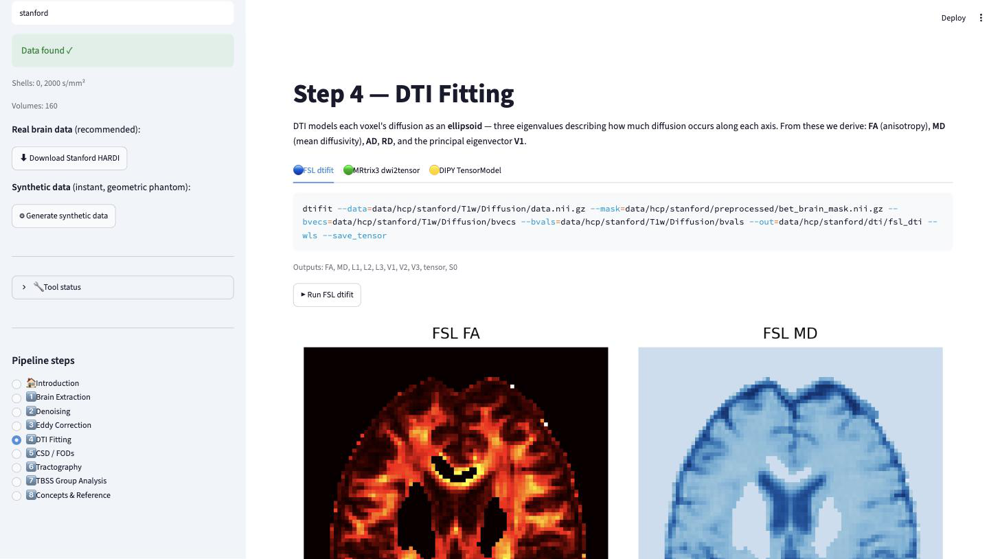
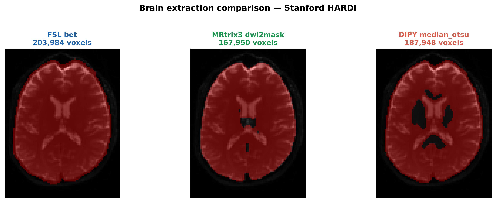
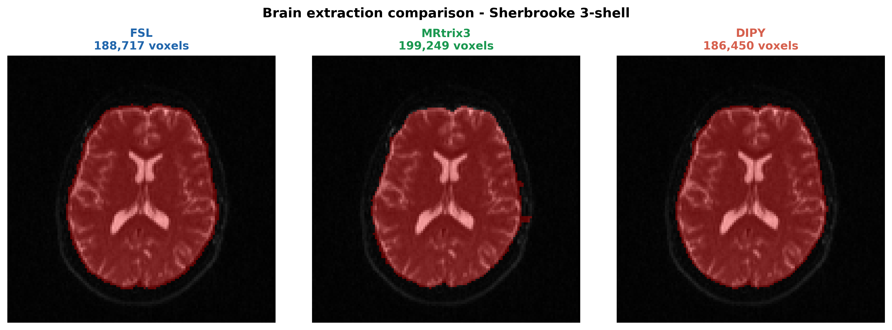
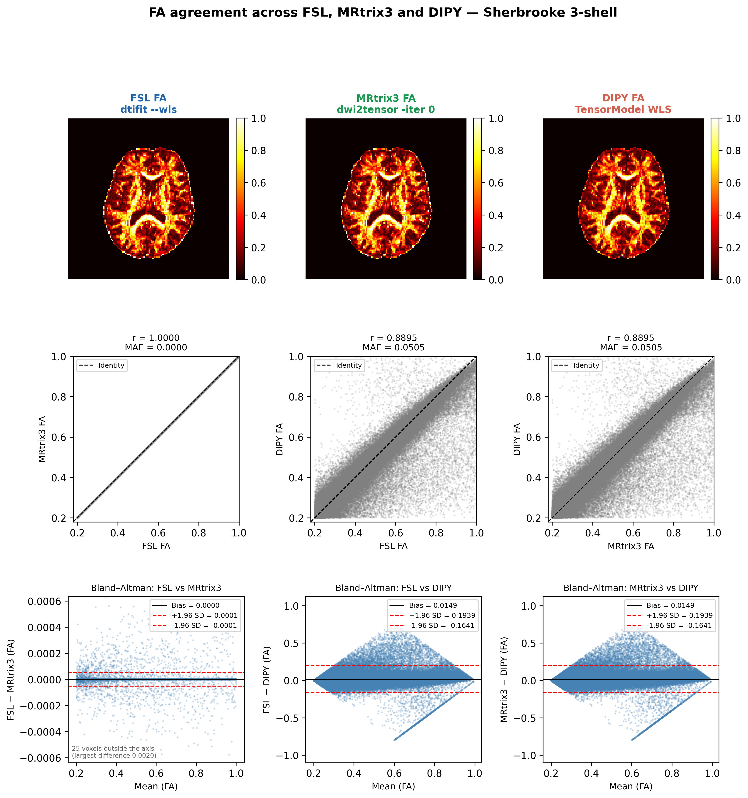

# Supplementary Material

**Diffusion MRI toolkits differ in which estimator they use, not in how they implement the tensor fit**

Busra Mutlu Ipek, Department of Neuroimaging, King's College London

## S1. The execution environment

The comparison in the main text depends on running FSL, MRtrix3 and DIPY on byte-identical input. All three are installed in one Docker container (Merkel, 2014). The container also serves an interactive Streamlit interface (Streamlit Inc., 2019), which presents each pipeline stage in the three toolkits side by side (Supplementary Figure S1). The interface is described here for completeness; it is not evaluated in the article.

### Container build

The Dockerfile uses a two-stage build. The first stage copies MRtrix3 3.0.8 from the official `mrtrix3/mrtrix3` image, pinned by digest so that a later rebuild reproduces the same binaries. The second starts from `ubuntu:22.04`, installs FSL with the official `fslinstaller.py` (version 6.0.7 in the image used here) and copies MRtrix3 from the first stage. It then installs the Python 3.12 stack, including DIPY 1.12.1, NumPy 1.26 and nibabel. The two stages avoid dependency conflicts between FSL and MRtrix3. The image is built and launched with

```bash
docker build --platform linux/amd64 -t dmri-rosetta .
docker run --rm --platform linux/amd64 -p 8501:7860 dmri-rosetta
```

after which the interface is available at `http://localhost:8501`. No neuroimaging software is required on the host.

### Pipeline coverage

The interface covers seven stages, each on its own page:

- brain extraction: FSL `bet`, MRtrix3 `dwi2mask`, DIPY `median_otsu`;
- MP-PCA denoising: MRtrix3 `dwidenoise`, DIPY `mppca` (Veraart et al., 2016);
- eddy-current and motion correction: FSL `eddy` (Andersson and Sotiropoulos, 2016), MRtrix3 `dwifslpreproc`, DIPY rigid-body `motion_correction`;
- tensor fitting: FSL `dtifit`, MRtrix3 `dwi2tensor`, DIPY `TensorModel`;
- constrained spherical deconvolution: MRtrix3 `dwi2fod` (Tournier et al., 2007; Jeurissen et al., 2014) and DIPY;
- tractography: MRtrix3 `tckgen` with iFOD2 (Tournier et al., 2010) and `tcksift2` (Smith et al., 2015), FSL `probtrackx2`, DIPY `LocalTracking`;
- tract-based spatial statistics (Smith et al., 2006).

When a toolkit lacks a stage, the page says so; for example, FSL has no denoiser. Each page shows the exact command, which can be copied and run outside the container. A reference section gives a guide to DTI metrics, a glossary and a command reference. Human Connectome Project data (Van Essen et al., 2013) can be used by those with access; the article uses only the two open datasets.

### Availability and requirements

| | |
|---|---|
| **Project name** | dMRI Rosetta Stone |
| **Project home page** | https://github.com/happybrotherhood/dmri-rosetta-stone |
| **Archived version** | Release v1.1.0, Zenodo concept DOI 10.5281/zenodo.22106454 |
| **Operating system** | Platform independent (Linux, macOS, Windows) via Docker |
| **Programming language** | Python 3.12 |
| **Other requirements** | Docker ≥ 20.10 |
| **Bundled toolkits** | FSL 6.0.7, MRtrix3 3.0.8, DIPY 1.12.1 |
| **Licence** | MIT |
| **Restrictions for non-academic use** | None imposed by this project. The bundled FSL is distributed under the FSL Licence, which restricts commercial use; MRtrix3 (MPL 2.0) and DIPY (BSD 3-clause) carry no such restriction. |

## S2. Brain extraction

Brain extraction was compared separately from tensor fitting and makes the opposite choice about input. Each tool was run on the input its algorithm is designed for, because that input is part of the algorithm being compared. FSL `bet` was run on the mean b = 0 image, MRtrix3 `dwi2mask` on the full series, and DIPY `median_otsu` on the full series with the b = 0 volumes indexed. Agreement between each pair of masks was measured with the Dice similarity coefficient (DSC). The tensor fits did not use the FSL or MRtrix3 masks; every arm was given one shared mask, generated with the same `median_otsu` settings.

Pairwise DSC was between 0.9009 and 0.9277 on Stanford and between 0.9058 and 0.9668 on Sherbrooke (Supplementary Table S1). The coefficients conceal how differently the algorithms behave. On Stanford the mask volumes spanned 21%, from 167,950 voxels (MRtrix3) to 203,984 (FSL); on Sherbrooke they spanned 7%, and MRtrix3 moved from the most conservative mask to the most inclusive. Disagreement concentrated at the cortical boundary and at the lateral ventricles, which `median_otsu` excluded and the other two retained (Supplementary Figures S2 and S3). A mask that includes the ventricles admits high-diffusivity, near-isotropic voxels into any subsequent statistics.

**Supplementary Table S1. Brain mask agreement.** Dice similarity coefficient for each pair of masks, and mask volume in voxels.

| Dataset | FSL vs. MRtrix3 | FSL vs. DIPY | MRtrix3 vs. DIPY | FSL voxels | MRtrix3 voxels | DIPY voxels |
|---|---|---|---|---|---|---|
| Stanford | 0.9024 | 0.9277 | 0.9009 | 203,984 | 167,950 | 187,948 |
| Sherbrooke | 0.9058 | 0.9668 | 0.9163 | 188,717 | 199,249 | 186,450 |

## S3. Agreement with the estimator matched, Sherbrooke

Supplementary Figure S4 repeats Figure 2 of the main text for the Sherbrooke data (b = 0 and b = 1000 s/mm² subset). FSL `--wls` and MRtrix3 `-iter 0` coincide (r = 1.0000, 95% limits of agreement ±0.0001 FA units), and both differ from DIPY WLS by the same amount (FA r = 0.8895, MAE 0.0505).

## S4. Phantom accuracy in the isotropic region

**Supplementary Table S2. Accuracy in the isotropic region of the phantoms.** True FA = 0, true MD = 0.90 µm²/ms; 5,408 voxels per region; Rician noise. SNR gives the nominal value of Table 6; this region had S₀ = 800, so its SNR was 24, 16 and 8. Bias is estimate minus truth; its standard error was at most 0.0011 for FA and 0.0010 for MD. Noise induces a positive FA bias in every arm, smallest with measured-signal weighting. Only measured-signal weighting underestimates MD by a substantial amount. MD in µm²/ms.

| SNR | Arm | Weights | FA bias | FA RMSE | MD bias | MD RMSE |
|---|---|---|---|---|---|---|
| 30 | FSL `--wls` / MRtrix3 `-iter 0` | measured | +0.0856 | 0.0898 | −0.0135 | 0.0260 |
|  | DIPY WLS (default) | predicted | +0.0860 | 0.0902 | 0.0000 | 0.0226 |
|  | MRtrix3 default | predicted | +0.0863 | 0.0905 | 0.0000 | 0.0226 |
|  | FSL default (OLS) | none | +0.0862 | 0.0904 | 0.0000 | 0.0226 |
| 20 | FSL `--wls` / MRtrix3 `-iter 0` | measured | +0.1275 | 0.1338 | −0.0296 | 0.0444 |
|  | DIPY WLS (default) | predicted | +0.1288 | 0.1350 | 0.0000 | 0.0341 |
|  | MRtrix3 default | predicted | +0.1297 | 0.1360 | 0.0000 | 0.0341 |
|  | FSL default (OLS) | none | +0.1296 | 0.1359 | 0.0000 | 0.0341 |
| 10 | FSL `--wls` / MRtrix3 `-iter 0` | measured | +0.2485 | 0.2602 | −0.1042 | 0.1217 |
|  | DIPY WLS (default) | predicted | +0.2535 | 0.2652 | −0.0012 | 0.0701 |
|  | MRtrix3 default | predicted | +0.2587 | 0.2705 | −0.0005 | 0.0703 |
|  | FSL default (OLS) | none | +0.2622 | 0.2752 | −0.0001 | 0.0706 |

## S5. Simulations

**Supplementary Table S3. Bias and error of the two weighting schemes on the real gradient tables.** Simplified simulation: axially symmetric tensors, true MD = 0.70 µm²/ms, random orientation, Rician noise, 10,000 voxels per condition. Each cell gives measured-signal weighting (FSL `--wls`, MRtrix3 `-iter 0`) / predicted-signal weighting (DIPY WLS), fitted to the same voxels. Bias is estimate minus truth; its Monte Carlo standard error was at most 0.0011. Three of the six simulated FA values are shown. `weighting_simulation.txt` in the repository gives all of them, for all four linear estimators, including the OLS and IWLS defaults of FSL and MRtrix3. Supplementary Table S4 gives every FA bin at each dataset's measured SNR. MD in µm²/ms.

| Protocol | SNR | True FA | FA bias, measured / predicted | FA RMSE, measured / predicted | MD bias, measured / predicted | MD RMSE, measured / predicted |
|---|---|---|---|---|---|---|
| Stanford (10 b = 0 + 150 at b = 2000) | 10 | 0.25 | −0.0462 / −0.0020 | 0.0634 / 0.0458 | −0.1146 / −0.0063 | 0.1165 / 0.0243 |
|  |  | 0.45 | −0.0994 / −0.0277 | 0.1083 / 0.0500 | −0.1227 / −0.0141 | 0.1245 / 0.0278 |
|  |  | 0.65 | −0.1194 / −0.0401 | 0.1255 / 0.0523 | −0.1383 / −0.0272 | 0.1400 / 0.0368 |
|  | 20 | 0.25 | −0.0215 / +0.0023 | 0.0317 / 0.0238 | −0.0367 / −0.0003 | 0.0383 / 0.0118 |
|  |  | 0.45 | −0.0399 / −0.0014 | 0.0455 / 0.0216 | −0.0414 / −0.0007 | 0.0430 / 0.0125 |
|  |  | 0.65 | −0.0442 / −0.0039 | 0.0477 / 0.0168 | −0.0504 / −0.0029 | 0.0519 / 0.0135 |
|  | 30 | 0.25 | −0.0103 / +0.0012 | 0.0188 / 0.0159 | −0.0170 / 0.0000 | 0.0186 / 0.0078 |
|  |  | 0.45 | −0.0197 / −0.0003 | 0.0245 / 0.0144 | −0.0200 / −0.0003 | 0.0215 / 0.0082 |
|  |  | 0.65 | −0.0217 / −0.0009 | 0.0245 / 0.0110 | −0.0249 / −0.0007 | 0.0263 / 0.0089 |
|  | 50 | 0.25 | −0.0038 / +0.0006 | 0.0101 / 0.0095 | −0.0064 / −0.0001 | 0.0078 / 0.0046 |
|  |  | 0.45 | −0.0074 / −0.0001 | 0.0113 / 0.0085 | −0.0074 / 0.0000 | 0.0088 / 0.0049 |
|  |  | 0.65 | −0.0082 / −0.0002 | 0.0105 / 0.0064 | −0.0095 / −0.0002 | 0.0108 / 0.0053 |
| Sherbrooke (1 b = 0 + 64 at b = 1000) | 10 | 0.25 | +0.0335 / +0.0371 | 0.0880 / 0.0855 | −0.0690 / +0.0003 | 0.1239 / 0.1035 |
|  |  | 0.45 | +0.0053 / +0.0163 | 0.0931 / 0.0874 | −0.0707 / +0.0012 | 0.1262 / 0.1050 |
|  |  | 0.65 | −0.0067 / +0.0071 | 0.0937 / 0.0837 | −0.0790 / −0.0028 | 0.1317 / 0.1063 |
|  | 20 | 0.25 | +0.0072 / +0.0097 | 0.0394 / 0.0395 | −0.0188 / −0.0005 | 0.0556 / 0.0523 |
|  |  | 0.45 | +0.0005 / +0.0050 | 0.0419 / 0.0416 | −0.0199 / −0.0008 | 0.0555 / 0.0519 |
|  |  | 0.65 | −0.0032 / +0.0018 | 0.0421 / 0.0409 | −0.0215 / −0.0009 | 0.0569 / 0.0527 |
|  | 30 | 0.25 | +0.0032 / +0.0044 | 0.0257 / 0.0258 | −0.0082 / 0.0000 | 0.0356 / 0.0346 |
|  |  | 0.45 | +0.0002 / +0.0023 | 0.0276 / 0.0275 | −0.0087 / −0.0001 | 0.0352 / 0.0342 |
|  |  | 0.65 | −0.0017 / +0.0007 | 0.0275 / 0.0271 | −0.0096 / −0.0002 | 0.0362 / 0.0349 |
|  | 50 | 0.25 | +0.0011 / +0.0016 | 0.0155 / 0.0155 | −0.0030 / −0.0001 | 0.0207 / 0.0205 |
|  |  | 0.45 | +0.0001 / +0.0009 | 0.0165 / 0.0165 | −0.0034 / −0.0003 | 0.0210 / 0.0208 |
|  |  | 0.65 | −0.0006 / +0.0002 | 0.0163 / 0.0163 | −0.0034 / 0.0000 | 0.0209 / 0.0206 |

**Supplementary Table S4. Simplified simulation at each dataset's measured SNR.** As Supplementary Table S3, at SNR 32.1 (Stanford) and 10.8 (Sherbrooke), for every FA bin. Each value is measured-signal minus predicted-signal weighting. Observed values and voxel counts are as in Table 7 of the main text. Simulated FA is the bin centre (0.80 for the 0.7–1.0 bin), and simulated MD is 0.70 µm²/ms. MD in µm²/ms.

| Dataset | FA bin | FA observed | FA simulated | MD observed | MD simulated |
|---|---|---|---|---|---|
| Stanford | 0.2–0.3 | −0.0077 | −0.0103 | −0.0339 | −0.0149 |
|  | 0.3–0.4 | −0.0140 | −0.0140 | −0.0301 | −0.0159 |
|  | 0.4–0.5 | −0.0186 | −0.0171 | −0.0285 | −0.0173 |
|  | 0.5–0.6 | −0.0231 | −0.0186 | −0.0313 | −0.0191 |
|  | 0.6–0.7 | −0.0272 | −0.0184 | −0.0364 | −0.0215 |
|  | 0.7–1.0 | −0.0410 | −0.0137 | −0.0719 | −0.0252 |
| Sherbrooke | 0.2–0.3 | +0.0099 | −0.0045 | −0.1431 | −0.0602 |
|  | 0.3–0.4 | +0.0154 | −0.0077 | −0.1302 | −0.0609 |
|  | 0.4–0.5 | +0.0168 | −0.0106 | −0.1235 | −0.0622 |
|  | 0.5–0.6 | +0.0137 | −0.0127 | −0.1144 | −0.0638 |
|  | 0.6–0.7 | +0.0124 | −0.0128 | −0.1097 | −0.0664 |
|  | 0.7–1.0 | +0.0237 | −0.0096 | −0.1157 | −0.0720 |

**Supplementary Table S5. Which idealisation reverses the Sherbrooke FA offset.** Rician noise was added at each voxel's MP-PCA σ to the real tensors of Table 7, that is, to the DIPY fit with negative eigenvalues clipped at zero. One idealisation of the simplified simulation was imposed at a time. "All four" combines MD of 0.70 µm²/ms, axial symmetry, random orientation, and uniform S₀ and σ; it approximates the simplified simulation. Each value is measured-signal minus predicted-signal weighting, over the voxels of Table 7, as the mean of five noise draws; standard errors were at most 0.0005. The FA offset over all voxels is given under each rule for non-physical fits (Supplementary Table S6); the bin and MD columns use the exclusion rule. The real white matter median MD was 0.616 µm²/ms on Stanford and 0.594 µm²/ms on Sherbrooke. MD in µm²/ms.

| Dataset | Tensors | FA, exclude | FA, clip | FA, keep | FA 0.5–0.6 | FA 0.7–1.0 | MD, all |
|---|---|---|---|---|---|---|---|
| Stanford | real | −0.0117 | −0.0111 | −0.0106 | −0.0148 | −0.0169 | −0.0193 |
|  | MD set to 0.70 | −0.0130 | −0.0128 | −0.0126 | −0.0191 | −0.0176 | −0.0231 |
|  | axially symmetric | −0.0129 | −0.0122 | −0.0118 | −0.0162 | −0.0182 | −0.0194 |
|  | random orientation | −0.0117 | −0.0110 | −0.0106 | −0.0148 | −0.0172 | −0.0193 |
|  | uniform σ | −0.0103 | −0.0093 | −0.0088 | −0.0137 | −0.0143 | −0.0190 |
|  | uniform S₀ and σ | −0.0108 | −0.0108 | −0.0107 | −0.0129 | −0.0098 | −0.0164 |
|  | all four | −0.0143 | −0.0143 | −0.0143 | −0.0186 | −0.0141 | −0.0172 |
| Sherbrooke | real | +0.0058 | +0.0093 | +0.0138 | +0.0092 | +0.0228 | −0.0800 |
|  | MD set to 0.70 | +0.0020 | +0.0050 | +0.0080 | −0.0006 | +0.0124 | −0.0795 |
|  | axially symmetric | +0.0029 | +0.0050 | +0.0095 | +0.0052 | +0.0150 | −0.0796 |
|  | random orientation | +0.0061 | +0.0094 | +0.0138 | +0.0095 | +0.0232 | −0.0802 |
|  | uniform σ | +0.0088 | +0.0129 | +0.0175 | +0.0106 | +0.0235 | −0.0831 |
|  | uniform S₀ and σ | −0.0001 | +0.0012 | +0.0031 | +0.0009 | +0.0138 | −0.0718 |
|  | all four | −0.0086 | −0.0085 | −0.0081 | −0.0126 | −0.0095 | −0.0653 |

**Supplementary Table S6. Sensitivity to the treatment of non-physical fits.** Voxels of Table 7. Exclude: a voxel is left out when either fit is physically inadmissible (the rule of Table 7). Clip: FA is clipped to [0, 1] and MD to [0, 3] µm²/ms. Keep: values are used as fitted. Each rule is applied identically to observed and simulated data. Simulated values are means of five noise draws. The voxel's MP-PCA σ was multiplied by 1.00, by 1.28 (the measured noise level), or by the upper bound set by the spread of the residuals (1.39 on Stanford, 1.33 on Sherbrooke). Shares are the simulated offset at 1.28σ divided by the observed offset. All values are over all voxels. MD in µm²/ms.

| Dataset | Rule | FA observed | FA sim (1.00σ) | FA sim (1.28σ) | FA sim (bound) | Share of FA | MD observed | MD sim (1.28σ) | Share of MD |
|---|---|---|---|---|---|---|---|---|---|
| Stanford | exclude | −0.0165 | −0.0117 | −0.0167 | −0.0189 | 101% | −0.0336 | −0.0279 | 83% |
|  | clip | −0.0156 | −0.0111 | −0.0157 | −0.0178 | 101% | −0.0344 | −0.0280 | 82% |
|  | keep | −0.0151 | −0.0106 | −0.0152 | −0.0173 | 101% | −0.0353 | −0.0281 | 80% |
| Sherbrooke | exclude | +0.0145 | +0.0058 | +0.0129 | +0.0144 | 89% | −0.1270 | −0.1110 | 87% |
|  | clip | +0.0195 | +0.0093 | +0.0183 | +0.0201 | 94% | −0.1352 | −0.1167 | 86% |
|  | keep | +0.0239 | +0.0138 | +0.0255 | +0.0278 | 106% | −0.1419 | −0.1289 | 91% |

**Supplementary Table S7. Checks of the real-data offsets.** Offsets over the voxels of Table 7, under the exclusion rule. Three operations are compared: removing diffusion-weighted measurements more than 3σ below the predicted signal, removing any measurement beyond ±3σ, and shuffling each voxel's residuals across gradient directions. Here σ is the voxel's MP-PCA σ. Real: the operation applied to the real data. Noise only: the same operation applied to simulated data at 1.28σ, as a control (means of five noise draws; standard errors at most 0.0001). Residuals beyond −3σ and +3σ made up 1.38% and 2.37% of real measurements on Stanford (noise only: 0.57% and 1.02%), and 0.49% and 1.64% on Sherbrooke (noise only: 0.29% and 0.95%). MD in µm²/ms.

| Dataset | Operation | FA, real | FA, noise only | MD, real | MD, noise only |
|---|---|---|---|---|---|
| Stanford | as fitted | −0.0165 | −0.0167 | −0.0336 | −0.0279 |
|  | measurements below −3σ removed | −0.0160 | −0.0163 | −0.0309 | −0.0269 |
|  | measurements beyond ±3σ removed | −0.0155 | −0.0160 | −0.0270 | −0.0252 |
|  | residuals shuffled across directions | −0.0241 | −0.0213 | −0.0346 | −0.0289 |
| Sherbrooke | as fitted | +0.0145 | +0.0129 | −0.1270 | −0.1110 |
|  | measurements below −3σ removed | +0.0132 | +0.0121 | −0.1233 | −0.1090 |
|  | measurements beyond ±3σ removed | +0.0079 | +0.0092 | −0.1157 | −0.1041 |
|  | residuals shuffled across directions | +0.0049 | +0.0039 | −0.1224 | −0.1074 |

## S6. Reproducing every table

All commands run inside the container from the repository root. First retrieve both datasets:

```bash
python scripts/fetch_sample_data.py --subject stanford
python scripts/fetch_sample_data.py --subject sherbrooke
```

Then run the following block once for each dataset. For Sherbrooke, replace `stanford` with `sherbrooke` and add `--shell 1000` to every `generate_fa_maps.py` call.

```bash
# Tensor fits: arms of Table 2, then MRtrix3 -iter 0, FSL OLS, DIPY NLLS and RESTORE, denoised
python scripts/generate_fa_maps.py --subject stanford
python scripts/generate_fa_maps.py --subject stanford --mrtrix-iter 0
python scripts/generate_fa_maps.py --subject stanford --mrtrix-iter 0 --fsl-ols
python scripts/generate_fa_maps.py --subject stanford --mrtrix-iter 0 --dipy-method NLLS
python scripts/generate_fa_maps.py --subject stanford --mrtrix-iter 0 --dipy-method RESTORE
python scripts/generate_fa_maps.py --subject stanford --denoise

# Tables 2 and 9, Table S1                  -> fa_comparison_stats_stanford.txt
python scripts/compute_fa_comparison.py --subject stanford
# Table 3; also redraws Figure 2 with the estimator matched
#                                            -> fa_comparison_stats_stanford_iter0.txt
python scripts/compute_fa_comparison.py --subject stanford --mrtrix-iter 0
# Tables 8 and 9                             -> fa_comparison_stats_stanford_denoised.txt
python scripts/compute_fa_comparison.py --subject stanford --denoise
# Table 4                                    -> weighting_test_stanford.txt
python scripts/weighting_test.py --subject stanford
```

The remaining commands read both datasets, so they run once, after both blocks.

```bash
# Table 5                                    -> estimator_comparison.txt
python scripts/estimator_comparison.py

# Table 6, Table S2: one phantom per SNR, three fits each -> phantom_accuracy.txt
for snr in 30 20 10; do
  python scripts/make_test_data.py   --subject phantom_rician_snr$snr --snr $snr --outdir data/hcp
  python scripts/generate_fa_maps.py --subject phantom_rician_snr$snr --shell 1000
  python scripts/generate_fa_maps.py --subject phantom_rician_snr$snr --shell 1000 --mrtrix-iter 0
  python scripts/generate_fa_maps.py --subject phantom_rician_snr$snr --shell 1000 --mrtrix-iter 0 --fsl-ols
done
python scripts/phantom_accuracy.py

# Measured SNR                               -> snr_estimate.txt
python scripts/snr_estimate.py
# Reimplemented estimators against the toolkits' maps (Methods) -> tensor_estimators_check.txt
python scripts/tensor_estimators.py
# Tables S3 and S4                           -> weighting_simulation.txt
python scripts/weighting_simulation.py
# Table 7, observed values of Table S4, Tables S5-S7 -> sherbrooke_fa_diagnosis.txt
python scripts/sherbrooke_fa_diagnosis.py
```

## Supplementary figures

{width=16cm}

**Supplementary Figure S1.** The interactive interface at the tensor-fitting stage, on the Stanford HARDI dataset. The sidebar reports the detected shells and volume count and lists the pipeline pages; the main panel has one tab per toolkit, showing the exact command, the outputs it produces, a button that runs it, and the resulting maps.

{width=16cm}

**Supplementary Figure S2.** Brain extraction on the Stanford HARDI dataset. The mean b = 0 image in greyscale with each brain mask overlaid in red: FSL `bet` (left, 203,984 voxels), MRtrix3 `dwi2mask` (centre, 167,950) and DIPY `median_otsu` (right, 187,948). Dice coefficients are in Supplementary Table S1.

{width=16cm}

**Supplementary Figure S3.** As Supplementary Figure S2, for the Sherbrooke 3-shell dataset.

{width=16cm}

**Supplementary Figure S4.** As Figure 2 of the main text, for the Sherbrooke 3-shell dataset (b = 0 and b = 1000 s/mm² subset), with the estimator matched.

## Supplementary references

Andersson JLR and Sotiropoulos SN (2016) An integrated approach to correction for off-resonance effects and subject movement in diffusion MR imaging. *NeuroImage* 125, 1063–1078. doi: 10.1016/j.neuroimage.2015.10.019

Jeurissen B, Tournier JD, Dhollander T, Connelly A, and Sijbers J (2014) Multi-tissue constrained spherical deconvolution for improved analysis of multi-shell diffusion MRI data. *NeuroImage* 103, 411–426. doi: 10.1016/j.neuroimage.2014.07.061

Merkel D (2014) Docker: Lightweight Linux containers for consistent development and deployment. *Linux Journal* 2014, 2.

Smith RE, Tournier JD, Calamante F, and Connelly A (2015) SIFT2: Enabling dense quantitative assessment of brain white matter connectivity using streamlines tractography. *NeuroImage* 119, 338–351. doi: 10.1016/j.neuroimage.2015.06.092

Smith SM, Jenkinson M, Johansen-Berg H, Rueckert D, Nichols TE, Mackay CE, et al. (2006) Tract-based spatial statistics: Voxelwise analysis of multi-subject diffusion data. *NeuroImage* 31, 1487–1505. doi: 10.1016/j.neuroimage.2006.02.024

Streamlit Inc (2019) *Streamlit: A faster way to build and share data apps* [Computer software]. Available at: https://streamlit.io

Tournier JD, Calamante F, and Connelly A (2007) Robust determination of the fibre orientation distribution in diffusion MRI: Non-negativity constrained super-resolved spherical deconvolution. *NeuroImage* 35, 1459–1472. doi: 10.1016/j.neuroimage.2007.02.016

Tournier JD, Calamante F, and Connelly A (2010) Improved probabilistic streamlines tractography by 2nd order integration over fibre orientation distributions. *Proceedings of the International Society for Magnetic Resonance in Medicine* 18, 1670.

Van Essen DC, Smith SM, Barch DM, Behrens TEJ, Yacoub E, Ugurbil K, et al. (2013) The WU-Minn Human Connectome Project: An overview. *NeuroImage* 80, 62–79. doi: 10.1016/j.neuroimage.2013.05.041

Veraart J, Novikov DS, Christiaens D, Ades-aron B, Sijbers J, and Fieremans E (2016) Denoising of diffusion MRI using random matrix theory. *NeuroImage* 142, 394–406. doi: 10.1016/j.neuroimage.2016.08.016
